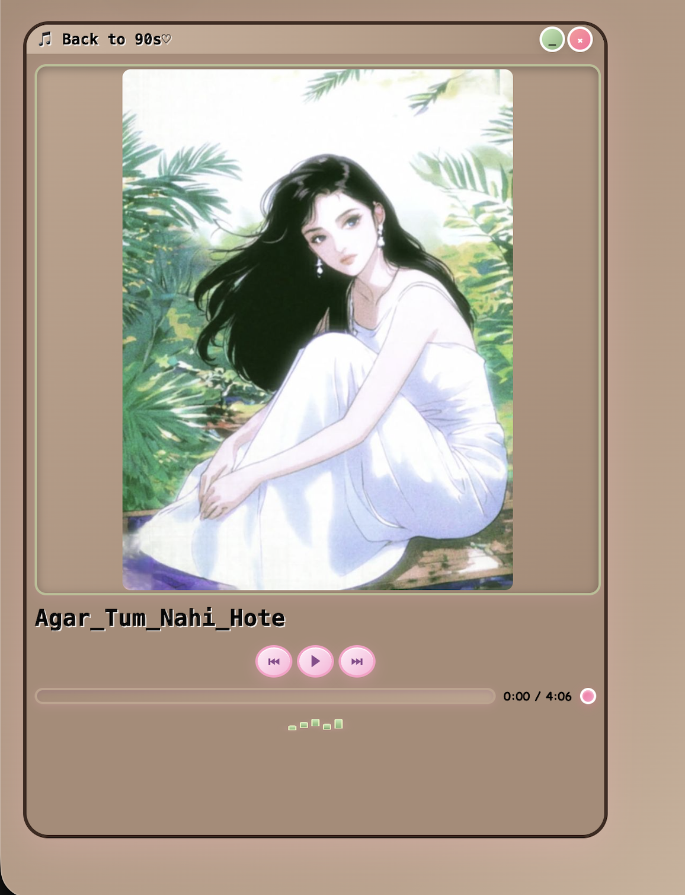
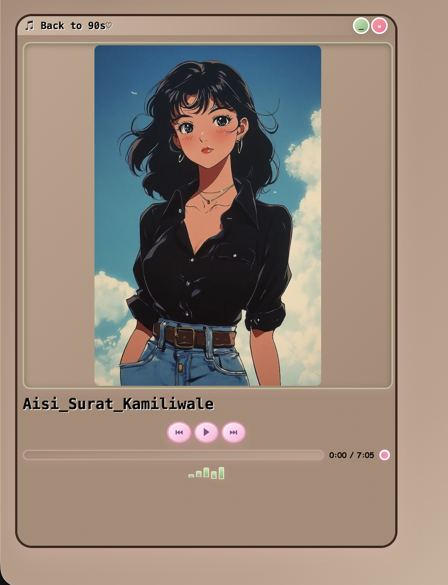
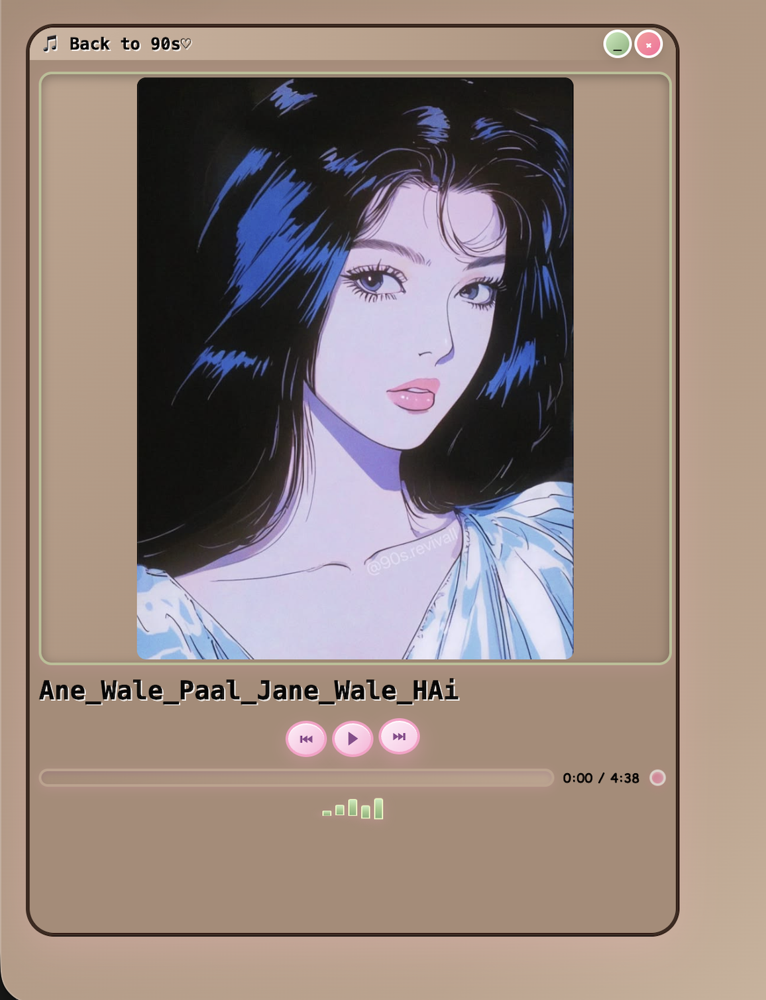

# 🎧 Vintage Melody – 90s Music Player 🤎

> Back to the 90s ♡  
> Relive timeless classics with a soft vintage aesthetic.

Vintage Melody is a web-based music player designed to bring back the golden era of 90s Indian songs with a nostalgic and minimal interface.

---

## ✨ Features

- 🎶 **Classic Music Player**
  - Play / Pause
  - Next / Previous controls
  - Smooth audio playback

- 📀 **Curated Playlist**
  - 12 handpicked 90s songs 🎧  
  - Focus on nostalgic Indian classics  

- ⏳ **Progress Tracking**
  - Real-time duration display  
  - Interactive progress bar  

- 🎚️ **Mini Visualizer**
  - Subtle animated bars for music feel  

- 🎨 **Vintage UI**
  - Soft brown & pastel tones 🤎  
  - Retro-inspired design  
  - Clean and distraction-free layout  

---

## 🎯 Highlights

- 🕰️ Nostalgic user experience  
- 🎧 Emotion-driven design  
- ⚡ Lightweight and fast  
- 💻 Pure frontend implementation  

---

## 🖥️ Screenshots

### Song 1


### Song 2


### Song 3


---

## 🛠️ Tech Stack

- **Frontend:** HTML, CSS, JavaScript  
- **Audio:** JavaScript Audio API  
- **Design:** Vintage / Retro UI  

---

## ⚙️ How to Run

```bash
# Clone repository
git clone https://github.com/Aakira14/vintage-melody.git

# Open folder
cd vintage-melody

# Run project
Open index.html in your browser
